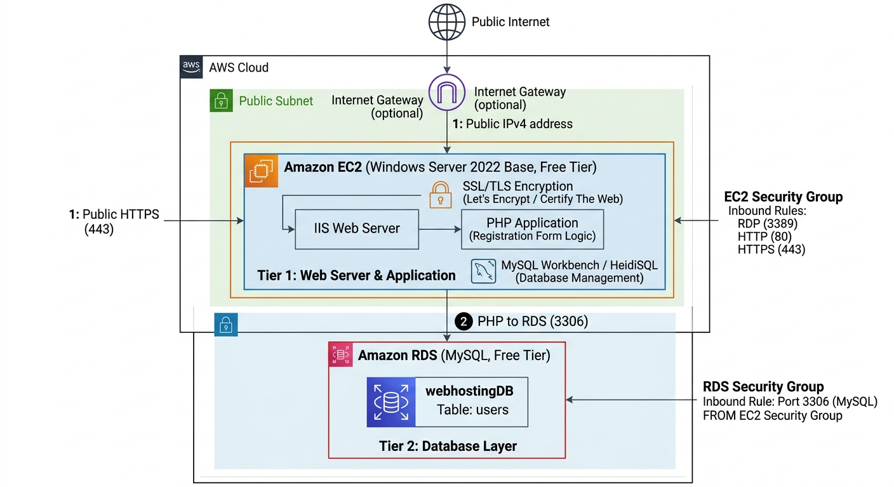
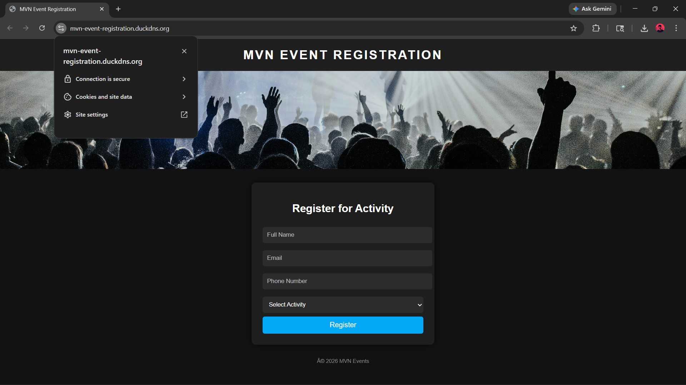
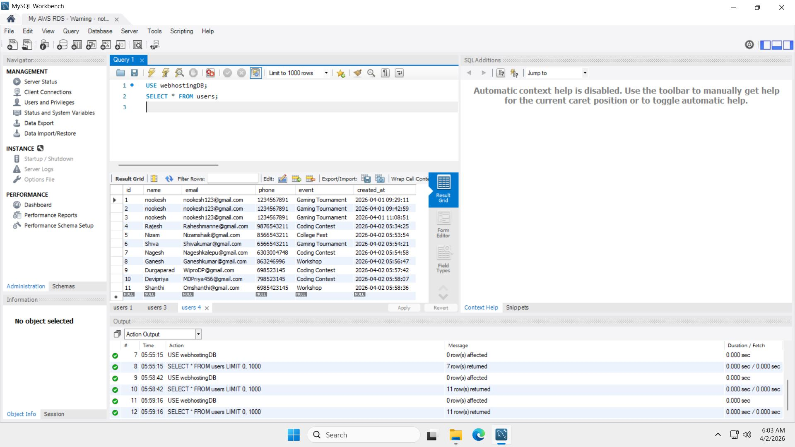
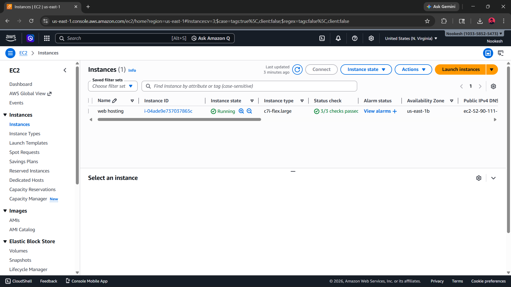
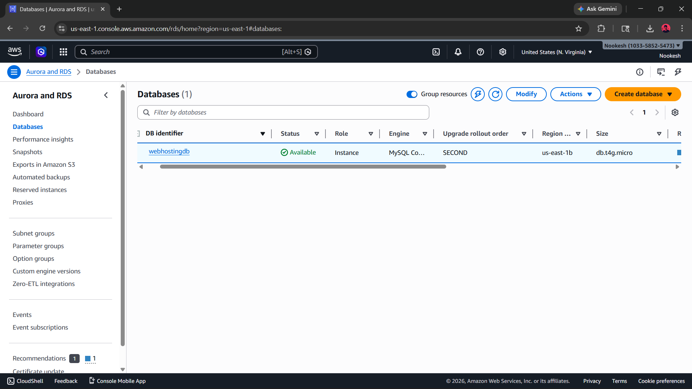

# 3-Tier Web Architecture on AWS (MVN Event Registration)

A fully functioning, genericsecure 3-tier genericcloud web application deployed entirely on Amazon Web Services (AWS).

**Project Objective:** To design and deploy a secure cloud infrastructure. The front-end and back-end application code (HTML/PHP) was intentionally generated using AI, allowing the primary focus of this project to remain entirely on compute provisioning, database networking, and server security.

## ☁️ Cloud Architecture & Tech Stack
* **Compute:** Amazon EC2 (Windows Server 2022)
* **Web Server:** Microsoft IIS configured with PHP (FastCGI)
* **Database:** Amazon RDS (MySQL)
* **Networking:** Custom Domain routing via DuckDNS
* **Security & Encryption:** Let's Encrypt SSL/TLS via Certify The Web, Custom AWS Security Groups

## 📌 Architecture Flow
`User (Browser)` ➔ `HTTPS (Port 443)` ➔ `EC2 Instance (IIS Web Server)` ➔ `TCP (Port 3306)` ➔ `Amazon RDS (MySQL)`

* **EC2 Security Group:** Inbound traffic restricted to HTTP (80), HTTPS (443), and RDP (3389).
* **RDS Security Group:** Inbound traffic restricted strictly to the EC2 instance's internal IP to prevent public database access.

## 📸 Deployment Proof

**1. Cloud Architecture Flow**

**2. Live Application Secured via HTTPS**

**3. Database Record Verification**

**4. AWS Infrastructure Provisioning**

## 🚧 Challenges Solved (Infrastructure Troubleshooting)
During deployment, I successfully troubleshot several critical infrastructure issues:
* **IIS Configuration:** Resolved `403 Forbidden` errors by configuring IIS Default Documents and PHP handlers.
* **Database Connectivity:** Debugged database schema connection errors by remotely connecting to the RDS instance via MySQL Workbench inside the server to manually initialize and manage the data layer.
* **Firewall Blocks:** Diagnosed `ERR_CONNECTION_TIMED_OUT` errors by configuring both the external AWS EC2 Security Groups and the internal Windows Defender Firewall to allow traffic over Port 443.

## ⚙️ Infrastructure Setup Steps
1. Provisioned AWS EC2 (Windows) and AWS RDS (MySQL) instances.
2. Configured Security Groups for secure EC2-to-RDS communication.
3. RDP into EC2 to install IIS and configure PHP via FastCGI.
4. Bound custom domain to the EC2 Public IP.
5. Generated and attached an SSL certificate using Let's Encrypt.
6. Initialized the RDS database tables using MySQL Workbench.

## 🚀 Future Improvements
- Migrate infrastructure deployment to **Terraform** (IaC).
- Place the EC2 instance behind an **Application Load Balancer (ALB)**.
- Implement **Amazon CloudWatch** for server health monitoring.
